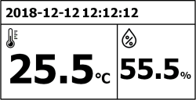

# RPI_EPAPER
E-Paper + DHT11 example for Raspberry Pi 

[Tutorial]
https://blog.naver.com/eziya76/221345489589 

 

2.13 inch E-Paper display from Waveshare was used for testing. 
https://www.waveshare.com/wiki/2.13inch_e-Paper_HAT 

DHT python library from Adafruit was used for testing. 
https://github.com/adafruit/Adafruit_Python_DHT 

DS-Digital font was used for testing. 
https://www.dafont.com/theme.php?cat=302

